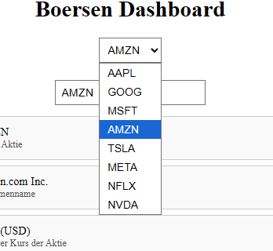

# Börsen Dashboard

Dieses Projekt ist ein Börsen-Dashboard, das es dem Nutzer ermöglicht, Informationen zu Aktien zu verfolgen. Die Anwendung zeigt wichtige Daten wie Aktienkurse und -namen und bietet eine Dropdown-Auswahl für die wichtigsten Aktien sowie die Möglichkeit, eine benutzerdefinierte Aktie einzugeben.

## Projektbeschreibung

Das Börsen-Dashboard zeigt Informationen zu Aktien in einer übersichtlichen Weise und ermöglicht es Nutzern, Daten wie den Preis, das Symbol und den Namen der Aktien zu visualisieren. Die App bietet auch eine API, die die Aktienkurse abruft und anzeigt. Wir haben uns für TwelveData für die Daten entschieden da es nicht kostenpflichtig ist.

## Technologien

- **Frontend**: HTML, CSS, JavaScript
- **Backend**: API-Abfragen
- **API-Datenquelle**: Externe Finanzdaten-API

## Screenshots

### 1. Ergebnisbild
Hier wird das Ergebnis der Börsenabfrage angezeigt, mit allen wichtigen Informationen wie den Aktienkursen.


### 2. Dropdown-Auswahl
Das Dropdown-Menü bietet eine Auswahl der wichtigsten Aktien. Alternativ kann eine benutzerdefinierte Aktie eingegeben werden.



### 3. API Ansicht
Diese Ansicht zeigt die Twelve Data wieviel mal wir die API benutzt haben


## Installation

1. Klone das Repository:
    ```bash
    git clone https://github.com/Berkayy19/Boersendashboard.git
    ```

2. Installiere die erforderlichen Abhängigkeiten:
    ```bash
    npm install
    ```

3. Starte den Entwicklungsserver:
    ```bash
    npm start
    ```

## Nutzung

1. Wähle eine Aktie aus der Dropdown-Liste oder gebe eine benutzerdefinierte Aktie ein.
2. Klicke auf "Ergebnis anzeigen", um die aktuellen Börsendaten der Aktie zu sehen.

## API

Die API stellt Daten zu den aktuellen Kursen, Symbolen und Namen der Aktien zur Verfügung.

## Contributing

Beiträge sind willkommen! Wenn du Vorschläge oder Verbesserungen hast, erstelle bitte einen Pull Request.
