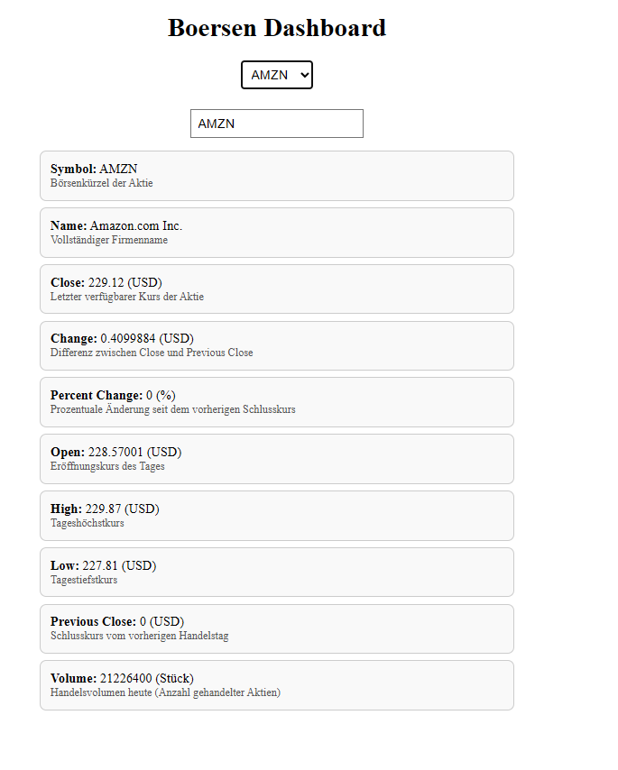

# Börsen Dashboard

Dieses Projekt ist ein **Börsen-Dashboard**, das es dem Nutzer ermöglicht, Informationen zu Aktien zu verfolgen. Die Anwendung zeigt wichtige Daten wie Aktienkurse, Namen und weitere Kennzahlen. Es gibt eine Dropdown-Auswahl für die wichtigsten Aktien sowie die Möglichkeit, eine benutzerdefinierte Aktie einzugeben.

---

## Projektbeschreibung

Das Dashboard visualisiert wichtige Aktieninformationen auf einfache Weise:

- Preis, Symbol, Name, Handelsvolumen und weitere Kennzahlen  
- Dropdown-Menü für 8 beliebte Aktien  
- Benutzerdefinierte Eingabe von Symbolen möglich  
- API-Abfragen via Spring Boot Backend, Datenquelle: **TwelveData API** (kostenfrei nutzbar)

---

## Technologien

- **Frontend:** React (JSX), HTML, CSS, JavaScript  
- **Backend:** Spring Boot (Java)  
- **API-Datenquelle:** TwelveData API  

---

## Screenshots

### 1. Ergebnisbild
Anzeige der Börsenabfrage mit allen relevanten Informationen.



### 2. Dropdown-Auswahl
Dropdown-Menü für die wichtigsten Aktien, alternativ Eingabe eines eigenen Symbols.


### 3. API Ansicht
Anzahl der API-Aufrufe und geladene Daten von TwelveData.


---


## Installation

1. Klone das Repository:
    ```bash
    git clone https://github.com/Berkayy19/Boersendashboard.git
    ```

2. Run and Build "BoersendashboardApplication" (Startet Backend)

3. Starte das Frontend:
    ```bash
    cd frontend
    npm install
    npm start
    ```

## Nutzung

Wähle eine Aktie aus der Dropdown-Liste oder gebe ein eigenes Symbol ein

Die aktuellen Börsendaten werden automatisch vom Backend geladen

Jedes Feld zeigt eine Beschreibung und Metrik (USD, %, Stück) zur besseren Verständlichkeit

## API

Die API stellt Daten zu den aktuellen Kursen, Symbolen und Namen der Aktien zur Verfügung.

## Contributing

Beiträge sind willkommen! Wenn du Vorschläge oder Verbesserungen hast, erstelle bitte einen Pull Request.
